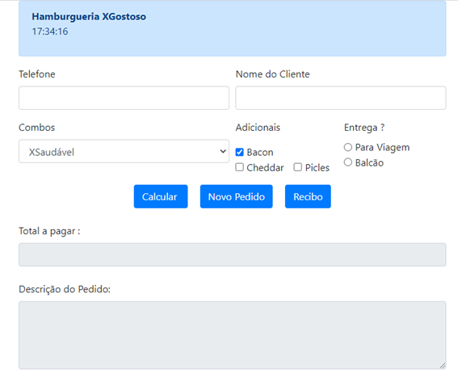
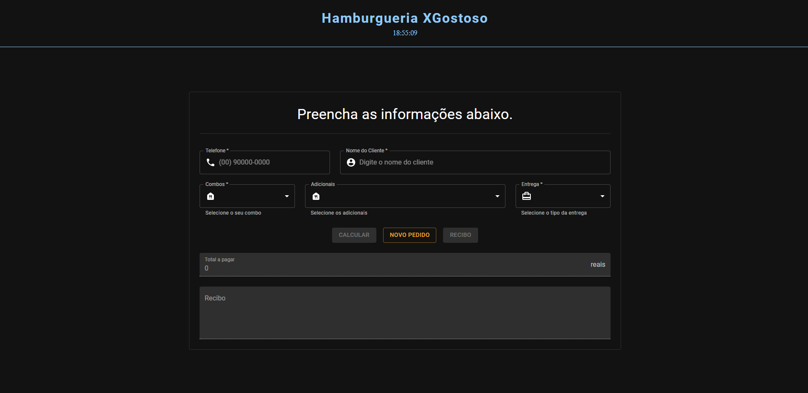

# Harburgueria XGostoso

Esse é um projeto em React criado usando Vite para um simples exercício de criação de uma UI, você pode acessar [clicando aqui.](https://facens-dev-web-exercicio-analise.surge.sh/)

## UI

Foi desenvolvida usando @emotion e também @mui, e foi baseada a seguinte imagem.

E o resultado ficou assim:

## Quem sou eu?

Nome: Vinícius Lourenço Claro Cardoso
RA: 180618
