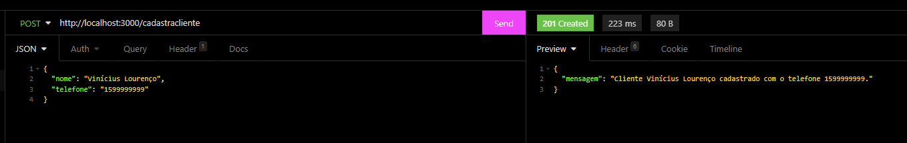
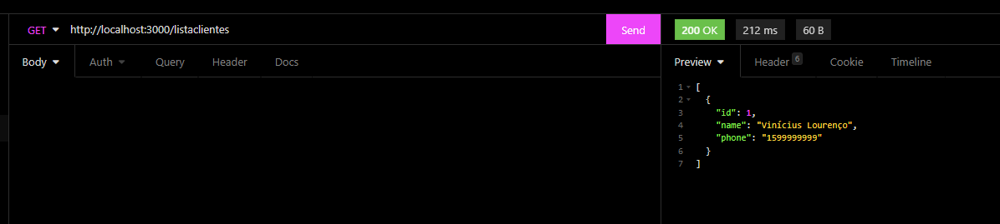
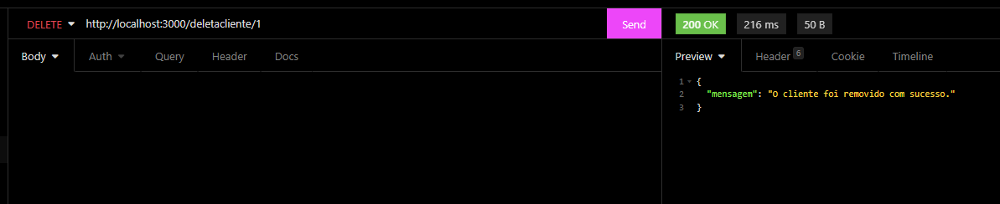
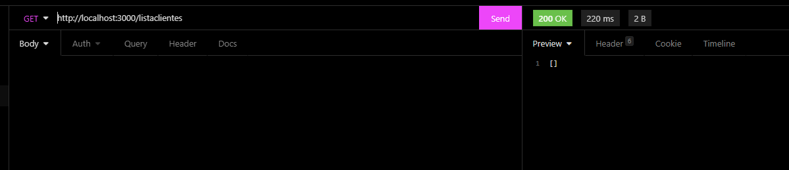

# API Project

A API que foi pedida na aula do dia 26/04/2022 durante a aula de Desenvolvimento Web.

## Rodar o projeto

Para rodar, basta instalar as dependencias e rodar o comando:

```bash
npm run start:debug
```

## Imagens

Como pedido na tarefa, segue abaixo as imagens do projeto rodando:

### Criar cliente



### Listar clientes



### Deletar um cliente



### Listar após deletar um cliente


